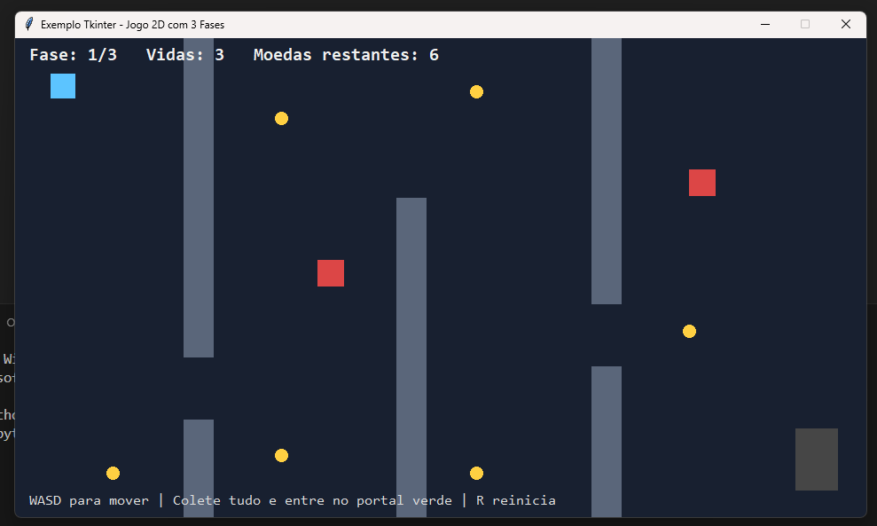
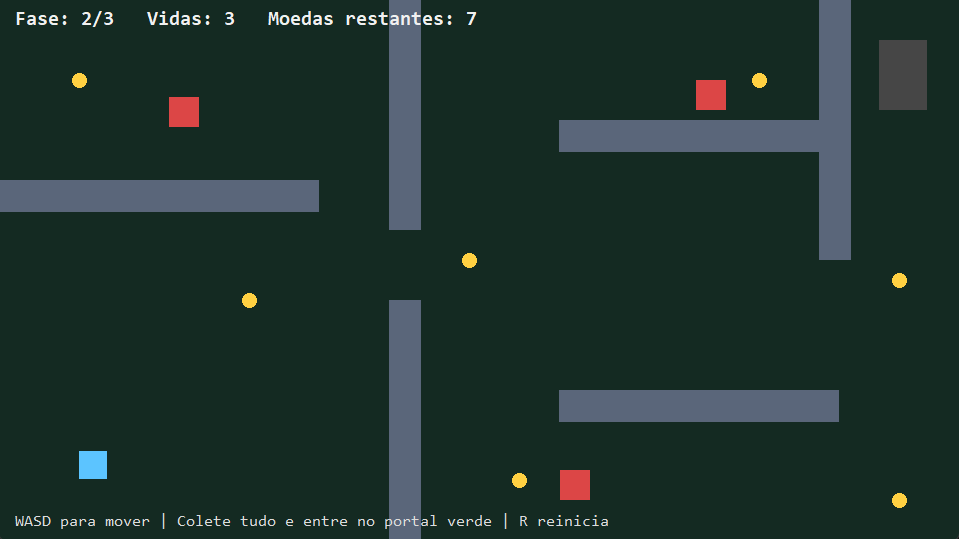

### Py Game

> * rodar o jogo
```  
python setup.py
```  

### preview level do jogo

> * Level 1 do jogo





### consutar comandos para salvar o projeto

> * passo 1 adicionar na area de stage    ( git add . )
> * passo 2 nome do commit rotulo do save ( git commit -m updated )
> * passo 3 colocar na nuvem              ( git push )